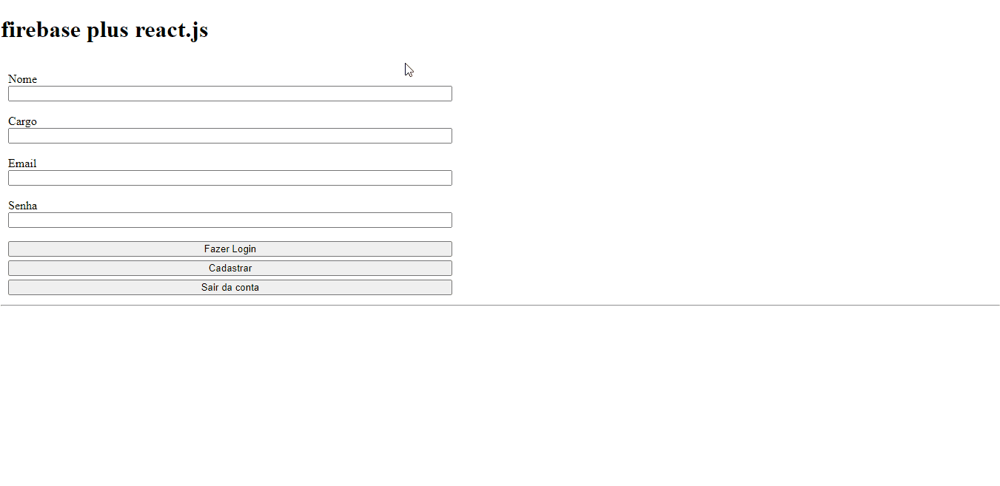

# firebase and react.js 

>◾ Making registration, login/logout; using useEffect, firebase library, async await.

 

### Techs used:
<a href="https://pt-br.reactjs.org/docs/getting-started.html" target="blank">react.js</a>;
 
<a href="https://developer.mozilla.org/pt-BR/docs/Web/JavaScript" target="blank">javascript</a>;
 
<a href="https://firebase.google.com/docs">firebase.</a>

 

## 🤝 Collaborators

<a href="https://www.linkedin.com/in/marcusviniciusbeghelisantos/" target="blank">Marcus Vinícius</a> 

